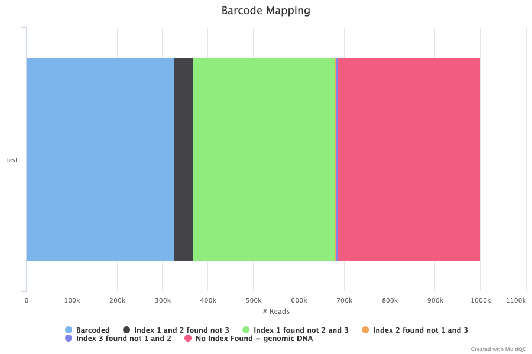
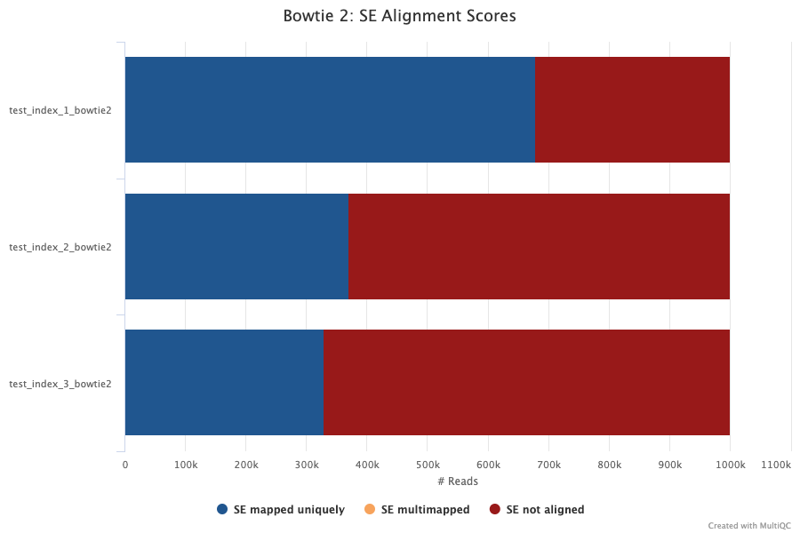
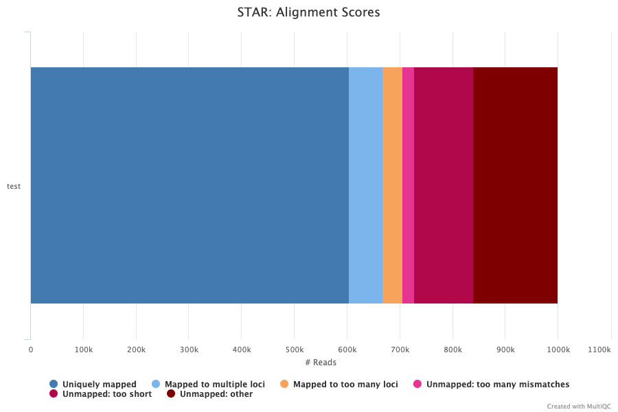
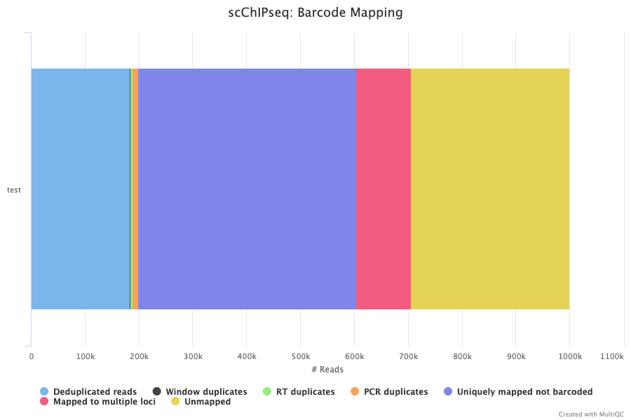

# Outputs

This document describes the output produced by the pipeline. Most of the plots are taken from the MultiQC report, which summarises results at the end of the pipeline.

## Pipeline overview

The pipeline is built using [Nextflow](https://www.nextflow.io/)
and processes the data using the steps presented in the main README file.  
Briefly, its goal is to process single-cell ChIP-seq data from inDrop protocol.

The directories listed below will be created in the output directory after the pipeline has finished. 

### Barcode Matching

Barcodes are composed of three indexes originating from three different libraries. 

=> % attendu ?

+ de 40% barc= success
[20-40%]=warn
<20%=danger

### Bowtie2

[Bowtie2](http://bowtie-bio.sourceforge.net/bowtie2/manual.shtml#the-bowtie2-aligner) software is used to aligned barcodes to index reference libraries. 

- **SE mapped uniquely** : successfully aligned sequence to a unique index.  
- **SE multimapped** : sequence aligned on multiple indexes.  
- **SE not aligned** : sequence corresponding to none index. 

drop apres 1er index observed. caused : not ligated correctly. ligation séquentielle : first indx 1 is ligated, then 2 then 3 ligués..il ft que les premiers soient bien. perte d'index à chq round. 

1:
~75

2:
~50

3:
~40

### STAR

[STAR](https://physiology.med.cornell.edu/faculty/skrabanek/lab/angsd/lecture_notes/STARmanual.pdf) software is used to aligned reads to a reference genome. 

- **Uniquely mapped** : successfully aligned reads to one single locus.  
- **Mapped to multiple loci** : 1-10
- **Mapped too many loci** : +2 reads mapped to more than 1 locus. 
- **Unmapped: too many mismatches** : 
- **Unmapped: too short** : less than 66% of reads length (R1+R2) are correctly aligned on the genome. 
- **Unmapped other: other** : other reasons than "too short" or "too many" like for example due to a foreign genome contamination or if reads came from a
from a higly repeated region. 

+60 succ
-40 60 warn
-40 danger

### Alignment Scores

on bc + aligned reads

dedup:
+5 = sc
1-5 = wn
-5 danger

arround 70% 

sur les 4 premiers:
30 rt 
-40= sc
40-50
+50: 

30 pcr
-40 = sc
10 window
-10=sc
10-15=
+15=danger

## MultiQC
[MultiQC](http://multiqc.info) is a visualisation tool that generates a single HTML report summarising all samples in your project. Most of the pipeline QC results are visualised in the report and further statistics are available within the report data directory.

The pipeline has special steps which allow the software versions used to be reported in the MultiQC output for future traceability.

**Output directory: `multiqc`**

* `multiqc_report.html`
  * MultiQC report - a standalone HTML file that can be viewed in your web browser.
* `multiqc_data/`
  * Directory containing parsed statistics from the different tools used in the pipeline.

For more information about how to use MultiQC reports, see http://multiqc.info.
